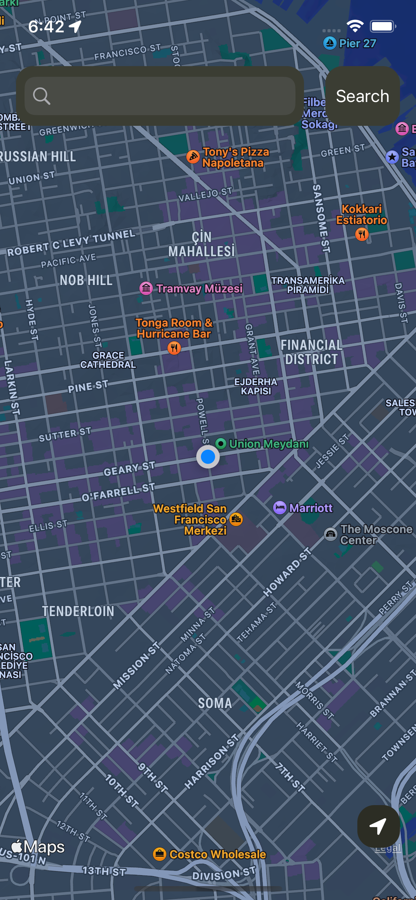
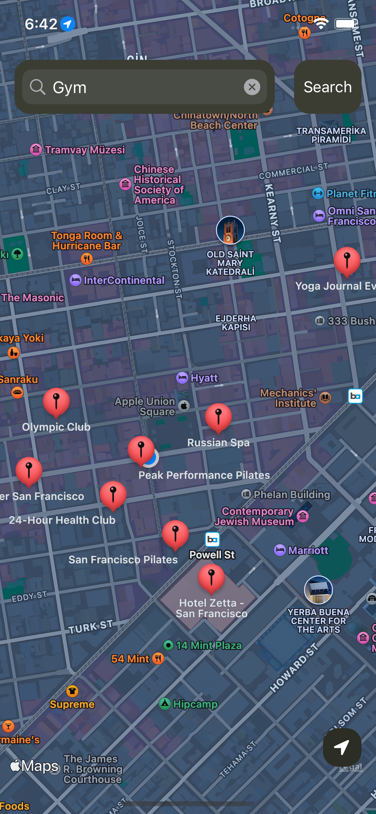
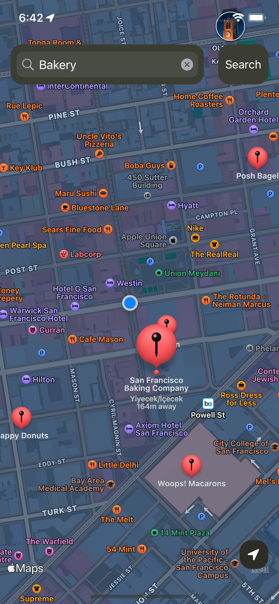
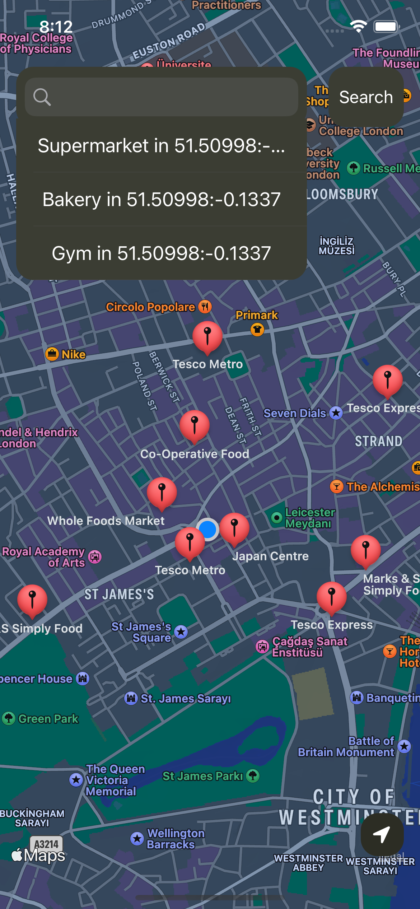
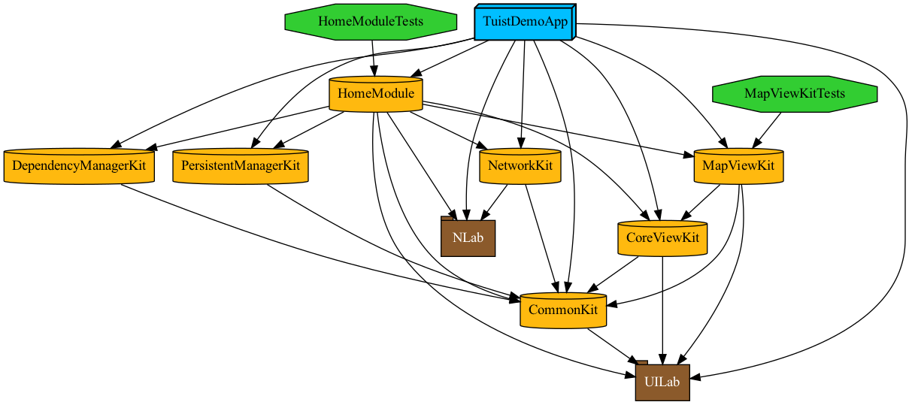

# TuistExampleCase

### Important Note

The project uses [Places API](https://places.demo.api.here.com/places/). To run the project, you need to define your API key under the APIKeys.plist file.

## Tech Stack

- Xcode Version: 14 beta
- iOS Version: iOS 16
- Third-party Dependencies: UILab, NLab
- [Tuist](https://tuist.io) Version: 1.52.0
- Modular Architecture
- Core Data
- VIPER
- Unit Tests

### Screenshots
| 1 | 2 | 3 | 4 |
|---|--|--|---|
|  |  |  |  | 

### Dependency Graph

